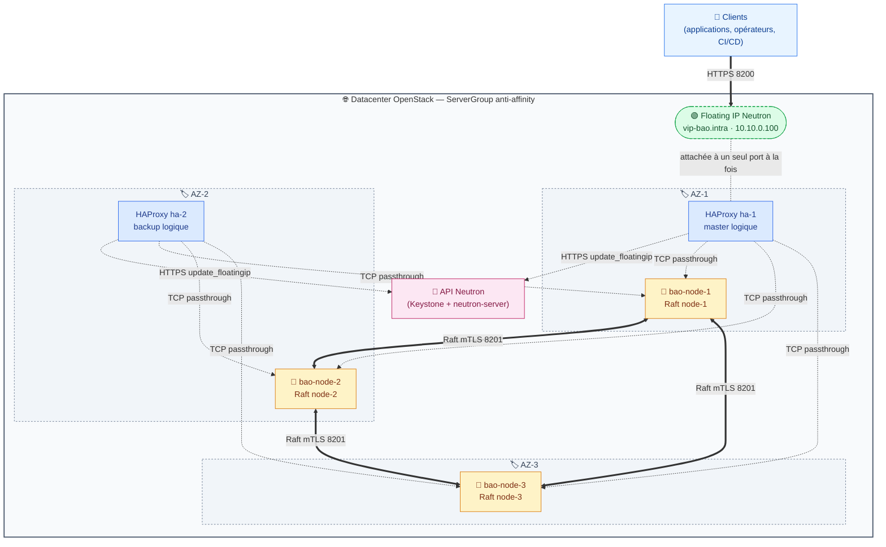

# OpenBao HA — Déploiement Ansible mono-DC sur OpenStack

> Projet Ansible *production-grade* pour déployer **OpenBao** (fork open-source de HashiCorp Vault) en haute disponibilité sur un unique datacenter OpenStack, avec un cluster Raft de 3 nœuds réparti sur 3 Availability Zones (anti-affinity), un frontal HAProxy actif/passif et une **Floating IP OpenStack** dont la bascule est pilotée par appels API Neutron (sans VRRP).

---

## Sommaire

1. [Vue d'ensemble](#1-vue-densemble)
2. [Architecture](#2-architecture)
3. [Choix d'architecture et justifications](#3-choix-darchitecture-et-justifications)
4. [Plan d'adressage et ports](#4-plan-dadressage-et-ports)
5. [Prérequis](#5-prérequis)
6. [Installation pas-à-pas](#6-installation-pas-à-pas)
7. [Structure du projet](#7-structure-du-projet)
8. [Sécurité et hardening](#8-sécurité-et-hardening)
9. [Exploitation](#9-exploitation)
10. [Limitations connues](#10-limitations-connues)
11. [Références](#11-références)

---

## 1. Vue d'ensemble

| Élément | Valeur |
|---|---|
| **Produit déployé** | OpenBao (fork open-source de HashiCorp Vault) |
| **Mode HA** | Cluster Raft 3 nœuds, 1 nœud par AZ OpenStack (anti-affinity) |
| **Storage backend** | Raft Integrated Storage (pas de backend externe) |
| **Seal/Unseal** | Shamir manuel — 5 parts, seuil de 3 |
| **Load-balancing** | HAProxy en TCP passthrough, roundrobin |
| **Bascule frontale** | 1 Floating IP OpenStack (Neutron) déplacée par script systemd timer, sans VRRP |
| **TLS** | PKI interne, mTLS inter-nœuds, TLS 1.3 obligatoire |
| **OS cible** | Debian 13 (Trixie) |
| **Firewall** | nftables (politique drop par défaut) |
| **Paquet OpenBao** | `.deb` officiel depuis GitHub releases (vérif SHA256) |
| **Plateforme** | OpenStack (Nova + Neutron + Cinder), 1 DC, 3 AZ |

Le cluster OpenBao tourne sur 3 VMs réparties sur 3 Availability Zones OpenStack via un `ServerGroup` anti-affinity : un seul leader Raft à un instant T, deux *standby* qui répliquent l'état. La paire HAProxy (master/backup logiques) expose le service via une **Floating IP OpenStack** unique. La bascule de cette FIP est gérée par un script Python local (rôle `openstack_fip`) déclenché toutes les 10 secondes par un timer systemd : il vérifie la santé locale (HAProxy actif + `/v1/sys/health`) puis appelle l'API Neutron pour réattacher ou libérer la Floating IP. Pas de VRRP, pas de protocole 112, pas d'`allowed-address-pairs` : juste de l'HTTPS sortant vers Keystone et Neutron. HAProxy distribue le trafic *en roundrobin sur les trois nœuds OpenBao* — c'est OpenBao lui-même qui forwarde les écritures vers le leader (le standby relaie de manière transparente).

---

## 2. Architecture

### 2.1 Schéma logique (Mermaid)



### 2.2 Lecture du schéma

Quatre flux distincts circulent sur l'infrastructure. Le **flux client** (trait épais) part de n'importe quelle application et arrive sur la Floating IP du DC, en HTTPS sur le port 8200. Le **flux load-balancing** (trait pointillé) descend de la FIP (attachée au port Neutron de ha-1 en nominal, de ha-2 en bascule) vers HAProxy puis vers les trois nœuds OpenBao en TCP passthrough — la session TLS est terminée *par OpenBao*, jamais par HAProxy. Le **flux contrôle Neutron** est l'appel HTTPS sortant que chaque HAProxy fait toutes les 10 secondes vers Keystone + neutron-server pour vérifier l'état de la FIP et, si besoin, la réattacher à son propre port. Le **flux Raft** (trait épais bidirectionnel) est la réplication permanente entre les trois nœuds sur le port 8201 en mTLS, c'est lui qui garantit la cohérence du cluster, **inter-AZ** dans cette topologie.

### 2.3 Comportement en cas de panne

Si HAProxy master (ha-1) tombe, le timer systemd qui tourne sur ha-2 va, après `fip_health_consecutive_ko` checks KO consécutifs (défaut 3 × 10 s = 30 s), constater que ha-1 ne répond plus *et* que la FIP est toujours attachée à son port. Il appelle alors Neutron `update_floatingip(port_id=<port_ha-2>)` et la FIP migre. La fenêtre d'indisponibilité observée est de l'ordre de 30–45 secondes (paramétrable via `fip_health_consecutive_ko` et `fip_timer_period_sec`). Si un nœud OpenBao tombe, les deux survivants conservent le quorum Raft (2/3) et continuent de servir : Raft élit un nouveau leader si nécessaire en quelques secondes. Si une **AZ OpenStack entière tombe** (perte d'un hyperviseur, panne réseau d'AZ), le cluster perd au plus 1 OpenBao + 1 HAProxy → le quorum Raft est préservé (2/3) et la FIP est réattachée par le HAProxy de l'AZ survivante. **Si deux AZ tombent simultanément**, le quorum Raft est perdu : le cluster passe en lecture seule jusqu'au retour d'au moins un nœud — c'est le compromis assumé d'une topologie 3 nœuds. La perte du DC entier n'est *pas* couverte par cette architecture (mono-DC) ; pour cela, prévoir un cluster secondaire en DR avec snapshots Raft réguliers (cf. RUNBOOK §3).

---

## 3. Choix d'architecture et justifications

| Décision | Choix | Justification |
|---|---|---|
| Storage backend | Raft Integrated | Pas de SPOF externe, snapshots intégrés, c'est le standard recommandé en 2024+ |
| Seal | Shamir 5/3 manuel | Pas de dépendance externe (KMS/HSM) qui deviendrait elle-même critique |
| Distribution clés | 5 opérateurs distincts, coffres individuels | Pas d'unseal automatique = pas de point unique de compromission |
| TLS | PKI interne dédiée, TLS 1.3 only | Maîtrise totale du cycle de vie des certificats, pas de dépendance externe |
| HAProxy mode | TCP passthrough | OpenBao garde la terminaison TLS de bout en bout |
| Algorithme LB | roundrobin sans stickiness | OpenBao redirige nativement les écritures vers le leader |
| Healthcheck | `GET /v1/sys/health?standbyok=true&perfstandbyok=true` accept 200/429 | Standby utile pour les lectures, leader pour les écritures |
| Bascule frontale | Floating IP Neutron pilotée par script local + systemd timer | Pas de protocole 112 inter-AZ, pas d'`allowed-address-pairs`, pas de dépendance Octavia ; tout passe par l'API Neutron en HTTPS sortant |
| Compte OpenStack failover | Compte Keystone dédié, policy.yaml restreint à `update_floatingip` + `get_port` sur la FIP cible | Limite le blast-radius en cas de fuite du clouds.yaml |
| Hardening systemd | Capabilities minimales + sandboxing complet | Réduction maximale de la surface d'attaque kernel |
| Quorum | 3 nœuds répartis sur 3 AZ | Tolère la perte d'une AZ OpenStack |
| Anti-affinity | ServerGroup Nova `anti-affinity` | Garantit que 2 OpenBao ne sont jamais sur le même hyperviseur |

---

## 4. Plan d'adressage et ports

### 4.1 Ports

| Port | Usage | Règle nftables |
|---|---|---|
| `8200/tcp` | API OpenBao (TLS 1.3) | Accept depuis tout |
| `8201/tcp` | Cluster Raft (mTLS) | Accept uniquement depuis les IPs des pairs Raft |
| `8200/tcp` | Floating IP HAProxy frontend | Accept depuis tout |
| `8404/tcp` | HAProxy stats | Accept depuis le set `stats_sources` (supervision) |
| `443/tcp` (sortant) | API Keystone + Neutron | Egress depuis chaque HAProxy vers l'endpoint OpenStack |

Ces ports doivent **aussi** être autorisés en amont dans les security groups Neutron (cf. RUNBOOK §0.2). nftables fait office de second filtre local.

### 4.2 Inventaire (modèle)

| Hostname | AZ | Rôle | IP exemple | Floating IP |
|---|---|---|---|---|
| `bao-node-1` | az-1 | OpenBao | `10.10.0.10` | — |
| `bao-node-2` | az-2 | OpenBao | `10.10.0.11` | — |
| `bao-node-3` | az-3 | OpenBao | `10.10.0.12` | — |
| `ha-1` | az-1 | HAProxy master logique | `10.10.0.21` | `10.10.0.100` (attachée en nominal) |
| `ha-2` | az-2 | HAProxy backup logique | `10.10.0.22` | `10.10.0.100` (en cas de bascule) |

### 4.3 DNS attendu

Un seul enregistrement A : `vip-bao.intra` → `10.10.0.100` (la Floating IP Neutron). Les FQDN par hôte (`bao-node-1.intra`, etc.) sont nécessaires pour la validation des certificats mTLS Raft.

---

## 5. Prérequis

Côté contrôleur Ansible : Ansible 2.14+, Python 3.9+, accès SSH (clé) avec `sudo` sans mot de passe vers tous les hôtes cibles, les collections listées dans `requirements.yml`, et un Ansible Vault initialisé (`ansible-vault create inventories/production/group_vars/all/vault.yml`).

Côté hôtes cibles : Debian 13 (Trixie) fraîchement installé, résolution DNS interne fonctionnelle pour tous les FQDN du cluster, accès sortant aux GitHub releases pour télécharger le `.deb` OpenBao (ou un mirror interne) et accès HTTPS sortant vers les endpoints Keystone + Neutron pour la bascule de FIP. Le rôle installe et active `nftables` (politique drop par défaut sauf SSH/8200/8201). Si SELinux est souhaité, installer en amont `selinux-basics` + `selinux-policy-default` puis `selinux-activate` et reboot — par défaut Debian 13 utilise AppArmor, le rôle se limite donc au sandboxing systemd qui est OS-agnostique.

Côté OpenStack : 5 VMs Debian 13 provisionnées avec les bonnes contraintes (cf. RUNBOOK §0). Concrètement il faut un `ServerGroup` anti-affinity pour les 3 OpenBao, des security groups distincts pour openbao-nodes et haproxy-frontends, **une Floating IP préallouée** dont l'UUID est mis dans `openstack_floating_ip_id` (vault), et **un compte Keystone dédié** au failover avec une `policy.yaml` Neutron restreinte aux seules opérations `update_floatingip` + `get_port` sur cette FIP (cf. RUNBOOK §0.6). Sans Floating IP préallouée ni compte restreint, le cluster ne tolèrera pas la bascule HAProxy.

Côté humains : cinq opérateurs identifiés et formés pour détenir chacun **une** part Shamir, avec leur propre coffre offline (KeePass, YubiKey, etc.). **Sans ces cinq personnes, l'unseal après reboot est impossible.**

---

## 6. Installation pas-à-pas

```bash
# 1. Récupérer les collections Ansible
ansible-galaxy collection install -r requirements.yml

# 2. Créer le vault avec les secrets sensibles
ansible-vault create inventories/production/group_vars/all/vault.yml
# → renseigner pki_ca_passphrase, haproxy_stats_password,
#   openstack_auth (auth_url, username, password, project_name),
#   openstack_floating_ip_id (UUID de la FIP préallouée)

# 3. Compléter l'inventaire
vim inventories/production/hosts.yml
# → IPs, hostnames, interface réseau, etc.

# 4. Renseigner la version OpenBao et son checksum
vim inventories/production/group_vars/all/main.yml
# → openbao_version, openbao_checksum_sha256 (depuis GitHub releases)

# 5. Générer la PKI interne (sur le contrôleur)
ansible-playbook playbooks/pki.yml --ask-vault-pass

# 6. Déployer toute l'infrastructure
ansible-playbook playbooks/site.yml --ask-vault-pass

# 7. Initialiser le cluster — UNE SEULE FOIS, depuis bao-node-1
ssh bao-node-1
sudo -u openbao /usr/bin/bao operator init -key-shares=5 -key-threshold=3 -format=json > /tmp/init.json
# → distribuer immédiatement les 5 unseal keys et le root token, puis :
shred -u /tmp/init.json

# 8. Unseal des 3 nœuds (3 clés différentes par nœud)
# Voir docs/RUNBOOK.md section "Initialisation du cluster"
```

À l'issue de ces étapes, `bao operator raft list-peers` doit montrer les trois nœuds en *voter*, et un `curl -k https://vip-bao.intra:8200/v1/sys/health` doit retourner un 200 ou un 429.

---

## 7. Structure du projet

```
openbao-ha/
├── README.md                          ← ce fichier
├── ansible.cfg
├── requirements.yml
├── playbooks/
│   ├── site.yml                       ← orchestration complète
│   ├── pki.yml                        ← génération CA + certs hôtes
│   └── backup.yml                     ← snapshot Raft du leader
├── inventories/production/
│   ├── hosts.yml                      ← inventaire des 5 VMs (3 openbao + 2 haproxy)
│   └── group_vars/
│       ├── all/
│       │   ├── main.yml               ← variables globales
│       │   └── vault.yml.example      ← squelette du vault
│       ├── openbao.yml
│       └── haproxy.yml
├── roles/
│   ├── openbao/                       ← rôle principal (paquet .deb, TLS, config, systemd, nftables)
│   ├── haproxy/                       ← TCP passthrough + healthcheck OpenBao
│   ├── openstack_fip/                 ← bascule Floating IP Neutron (script Python + systemd timer)
│   └── keepalived/                    ← ⚠️ DEPRECATED — conservé pour rollback, non référencé par site.yml
└── docs/
    ├── RUNBOOK.md                     ← procédures d'exploitation
    └── architecture.drawio            ← schéma éditable draw.io
```

---

## 8. Sécurité et hardening

L'unit systemd `openbao.service` applique un sandboxing systemd complet : capabilities réduites au strict `CAP_IPC_LOCK` (nécessaire pour mlock), `ProtectSystem=strict`, `ProtectKernelTunables/Modules/Logs=true`, `PrivateTmp/Devices=true`, `NoNewPrivileges=true`, `MemoryDenyWriteExecute=true`, filtrage `SystemCallFilter=@system-service` excluant `@privileged`, `@resources`, `@mount`, `@swap`, `@reboot`, `@debug`. Les écritures sont restreintes par `ReadWritePaths` au seul `data_dir` et `log_dir`. Le service tourne sous l'utilisateur dédié `openbao` (system, nologin), jamais root.

Le binaire `bao` reçoit la capability `cap_ipc_lock=+ep` via `setcap`, ce qui permet d'utiliser `mlock()` sans tourner en root et donc d'empêcher le swap des secrets sur disque (`disable_mlock = false` dans la config).

nftables n'expose que ce qui est strictement nécessaire : politique `drop` par défaut sur la chaîne `input`, puis `accept` explicite pour SSH (22), pour l'API OpenBao (8200) et pour le port Raft 8201 *uniquement depuis les IPs des autres pairs* (générées dynamiquement depuis l'inventaire). Sur les HAProxy, deux sets nftables (`stats_sources` et `vrrp_peers`) restreignent respectivement la page stats à la supervision et VRRP au pair HAProxy du même DC. La politique de défaut est journalisée (rate-limited 5/min) pour faciliter le diagnostic.

Les secrets sensibles (passphrase de la CA, mot de passe stats HAProxy, mot de passe VRRP) sont dans Ansible Vault. **Les unseal keys Shamir et le root token ne sont JAMAIS dans Ansible Vault** — ils sont distribués manuellement à cinq opérateurs distincts, qui les conservent dans leur propre coffre offline.

---

## 9. Exploitation

Toute l'exploitation au quotidien est documentée dans [`docs/RUNBOOK.md`](docs/RUNBOOK.md), qui couvre :

- l'initialisation du cluster (unique et critique),
- l'unseal après chaque reboot (procédure 5 personnes / 3 clés),
- la prise et la restauration de snapshots Raft,
- la rotation des certificats TLS,
- l'ajout et le retrait d'un nœud,
- le dépannage (logs, statut cluster, santé HAProxy, VIP).

Un schéma éditable au format draw.io est fourni dans [`docs/architecture.drawio`](docs/architecture.drawio) pour diffusion interne et présentations.

---

## 10. Limitations connues

L'**initialisation et l'unseal sont manuels** — c'est un choix volontaire pour ne pas dépendre d'un KMS externe, mais cela signifie qu'un reboot du cluster impose la mobilisation de trois opérateurs habilités. La latence inter-DC impacte directement la latence d'écriture (consensus Raft) ; cette topologie suppose des liens inter-DC à moins de **10 ms RTT**, au-delà l'expérience client se dégrade. Il n'y a **pas de PRA automatique** vers un cluster secondaire — le DR repose sur les snapshots Raft réguliers (cf. `playbooks/backup.yml`) à restaurer manuellement. Enfin, la perte simultanée de deux DC sur trois entraîne la perte du quorum et bascule le cluster en lecture seule.

---

## 11. Références

- [OpenBao — documentation officielle](https://openbao.org/docs/)
- [OpenBao — GitHub releases](https://github.com/openbao/openbao/releases)
- [HashiCorp Raft — papier de référence](https://raft.github.io/)
- [Ansible collection `community.crypto`](https://docs.ansible.com/ansible/latest/collections/community/crypto/)
- [systemd — directives de sandboxing](https://www.freedesktop.org/software/systemd/man/systemd.exec.html)
- [HAProxy — documentation 2.4+](https://docs.haproxy.org/2.4/configuration.html)
