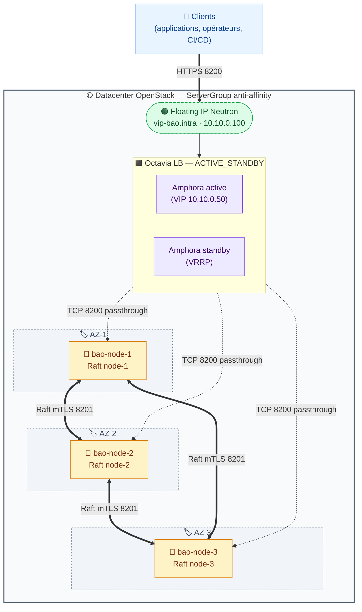

# OpenBao HA — Déploiement Ansible mono-DC sur OpenStack

> Projet *production-grade* pour déployer **OpenBao** (fork open-source de HashiCorp Vault) en haute disponibilité sur un unique datacenter OpenStack : un cluster Raft de 3 nœuds réparti sur 3 Availability Zones (anti-affinity) déployé par Ansible, et un frontal **Octavia (LBaaS OpenStack)** en topologie `ACTIVE_STANDBY` provisionné par Terraform.

---

## Sommaire

1. [Vue d'ensemble](#1-vue-densemble)
2. [Architecture](#2-architecture)
3. [Choix d'architecture et justifications](#3-choix-darchitecture-et-justifications)
4. [Plan d'adressage et ports](#4-plan-dadressage-et-ports)
5. [Prérequis](#5-prérequis)
6. [Installation pas-à-pas](#6-installation-pas-à-pas)
7. [Structure du projet](#7-structure-du-projet)
8. [Sécurité et hardening](#8-sécurité-et-hardening)
9. [Exploitation](#9-exploitation)
10. [Limitations connues](#10-limitations-connues)
11. [Références](#11-références)

---

## 1. Vue d'ensemble

| Élément | Valeur |
|---|---|
| **Produit déployé** | OpenBao (fork open-source de HashiCorp Vault) |
| **Mode HA** | Cluster Raft 3 nœuds, 1 nœud par AZ OpenStack (anti-affinity) |
| **Storage backend** | Raft Integrated Storage (pas de backend externe) |
| **Seal/Unseal** | Shamir manuel — 5 parts, seuil de 3 |
| **Load-balancing** | Octavia (LBaaS OpenStack), topologie `ACTIVE_STANDBY`, listener TCP:8200 passthrough, pool ROUND_ROBIN |
| **Bascule frontale** | VRRP entre amphorae Octavia (managé), bascule <5s ; Floating IP Neutron statiquement associée au port VIP du LB |
| **TLS** | PKI interne, mTLS inter-nœuds, TLS 1.3 obligatoire (terminaison TLS portée par OpenBao, pas par le LB) |
| **OS cible** | Debian 13 (Trixie) |
| **Firewall** | nftables (politique drop par défaut, 8200 restreint au subnet d'amphorae Octavia) |
| **Paquet OpenBao** | `.deb` officiel depuis GitHub releases (vérif SHA256) |
| **Plateforme** | OpenStack (Nova + Neutron + Octavia + Cinder), 1 DC, 3 AZ |
| **Provisionnement** | Ansible pour les nœuds OpenBao, Terraform pour le LB Octavia (cf. `terraform/octavia-lb/`) |

Le cluster OpenBao tourne sur 3 VMs réparties sur 3 Availability Zones OpenStack via un `ServerGroup` anti-affinity : un seul leader Raft à un instant T, deux *standby* qui répliquent l'état. Le frontal est un **load balancer Octavia** en topologie `ACTIVE_STANDBY` : deux amphorae (VMs managées par OpenStack) en VRRP, le secondaire reprend la VIP en moins de 5 secondes si le primaire tombe. La Floating IP `vip-bao.intra` est statiquement associée au port VIP du LB — plus de script de bascule applicative, plus de paire HAProxy à maintenir, plus de compte Keystone restreint. Octavia distribue le trafic *en ROUND_ROBIN sur les trois nœuds OpenBao* en TCP passthrough : OpenBao garde la terminaison TLS de bout en bout, et c'est lui qui forwarde les écritures vers le leader (un standby relaie de manière transparente).

---

## 2. Architecture

### 2.1 Schéma logique (Mermaid)



### 2.2 Lecture du schéma

Trois flux distincts circulent sur l'infrastructure. Le **flux client** (trait épais) part de n'importe quelle application et arrive sur la Floating IP du DC, en HTTPS sur le port 8200. Le **flux load-balancing** (trait pointillé) descend de la FIP (statiquement associée au port VIP du LB) vers l'amphora active, puis vers les trois nœuds OpenBao en TCP passthrough — la session TLS est terminée *par OpenBao*, jamais par le LB. Le **flux Raft** (trait épais bidirectionnel) est la réplication permanente entre les trois nœuds sur le port 8201 en mTLS, c'est lui qui garantit la cohérence du cluster, **inter-AZ** dans cette topologie. La HA frontale est entièrement portée par Octavia : VRRP entre amphorae, healthcheck `GET /v1/sys/health` toutes les 5 secondes, et le control plane Octavia recrée automatiquement une amphora si l'une des deux meurt.

### 2.3 Comportement en cas de panne

Si l'**amphora active** tombe, l'amphora standby reprend la VIP via VRRP en moins de 5 secondes — fenêtre d'indisponibilité réseau quasi imperceptible côté clients. Le control plane Octavia détecte la panne via son propre healthcheck et provisionne une nouvelle amphora standby dans la foulée (quelques minutes). Si un **nœud OpenBao** tombe, le monitor Octavia le sort du pool en 15–25 secondes (3 × 5 s healthcheck) ; pendant cette fenêtre une partie des requêtes peut être routée vers le nœud KO et échouer, le client doit retry. Les deux survivants conservent le quorum Raft (2/3) et continuent de servir. Si une **AZ OpenStack entière tombe**, le cluster perd au plus 1 nœud OpenBao → le quorum Raft est préservé (2/3). Les amphorae Octavia ne sont pas attachées aux AZ Nova de la même façon que les VMs OpenBao (elles sont gérées dans une AZ Octavia distincte) : la disponibilité du LB dépend de la configuration côté équipe OpenStack et de la topologie des amphorae. **Si deux AZ tombent simultanément**, le quorum Raft est perdu : le cluster passe en lecture seule jusqu'au retour d'au moins un nœud. Si le **control plane Octavia** (octavia-api, octavia-worker, octavia-health-manager) tombe, le dataplane (les amphorae existantes) continue de servir le trafic ; seule la gestion (modification config, recréation d'amphora) est bloquée — équivalent à n'importe quel service managé. La perte du DC entier n'est *pas* couverte par cette architecture (mono-DC) ; pour cela, prévoir un cluster secondaire en DR avec snapshots Raft réguliers (cf. RUNBOOK §3).

---

## 3. Choix d'architecture et justifications

| Décision | Choix | Justification |
|---|---|---|
| Storage backend | Raft Integrated | Pas de SPOF externe, snapshots intégrés, c'est le standard recommandé en 2024+ |
| Seal | Shamir 5/3 manuel | Pas de dépendance externe (KMS/HSM) qui deviendrait elle-même critique |
| Distribution clés | 5 opérateurs distincts, coffres individuels | Pas d'unseal automatique = pas de point unique de compromission |
| TLS | PKI interne dédiée, TLS 1.3 only | Maîtrise totale du cycle de vie des certificats, pas de dépendance externe |
| LB frontal | Octavia (LBaaS OpenStack) `ACTIVE_STANDBY` | Service managé, bascule VRRP entre amphorae <5s, plus de VMs HAProxy à patcher |
| Mode listener | TCP passthrough | OpenBao garde la terminaison TLS de bout en bout (iso ancienne archi HAProxy) |
| Algorithme LB | ROUND_ROBIN sans session persistence | OpenBao redirige nativement les écritures vers le leader |
| Healthcheck | `GET /v1/sys/health?standbyok=true&perfstandbyok=true` accept 200/429 | Standby utile pour les lectures, leader pour les écritures |
| Bascule frontale | VRRP entre amphorae Octavia (managé) | Pas de script de bascule applicatif à maintenir, pas de compte Keystone dédié au failover |
| Association FIP | Statique : FIP préallouée → port VIP du LB Octavia | DNS `vip-bao.intra` inchangé, transparent pour les clients |
| Provisionnement LB | Terraform (`terraform/octavia-lb/`) | Infra-as-code, plan/apply auditables, recréation déterministe |
| Hardening systemd | Capabilities minimales + sandboxing complet | Réduction maximale de la surface d'attaque kernel |
| Quorum | 3 nœuds répartis sur 3 AZ | Tolère la perte d'une AZ OpenStack |
| Anti-affinity | ServerGroup Nova `anti-affinity` | Garantit que 2 OpenBao ne sont jamais sur le même hyperviseur |

---

## 4. Plan d'adressage et ports

### 4.1 Ports

| Port | Usage | Règle nftables (sur les nœuds OpenBao) |
|---|---|---|
| `8200/tcp` | API OpenBao (TLS 1.3) | Accept depuis le subnet d'amphorae Octavia (`octavia_lb_subnet_cidr`) uniquement |
| `8201/tcp` | Cluster Raft (mTLS) | Accept uniquement depuis les IPs des pairs Raft |
| `22/tcp` | SSH administration | Accept (filtré en amont par security group Neutron) |

Côté Octavia, l'amphora expose `8200/tcp` au monde (via la FIP) et tape sur les 3 nœuds en `8200/tcp`. Ces flux doivent **aussi** être autorisés en amont dans les security groups Neutron (cf. RUNBOOK §0.2). nftables fait office de second filtre local.

### 4.2 Inventaire (modèle)

| Hostname | AZ | Rôle | IP exemple | Floating IP |
|---|---|---|---|---|
| `bao-node-1` | az-1 | OpenBao | `10.10.0.10` | — |
| `bao-node-2` | az-2 | OpenBao | `10.10.0.11` | — |
| `bao-node-3` | az-3 | OpenBao | `10.10.0.12` | — |
| _LB Octavia_ | _managé_ | LB ACTIVE_STANDBY | `10.10.0.50` (VIP interne) | `10.10.0.100` (FIP associée) |

Les amphorae Octavia ne sont pas dans l'inventaire Ansible : elles sont managées par le service OpenStack. Le LB est consultable via `openstack loadbalancer show <id>` (UUID disponible dans les outputs Terraform).

### 4.3 DNS attendu

Un seul enregistrement A : `vip-bao.intra` → `10.10.0.100` (la Floating IP Neutron, désormais associée au port VIP du LB Octavia). Les FQDN par hôte (`bao-node-1.intra`, etc.) sont nécessaires pour la validation des certificats mTLS Raft.

---

## 5. Prérequis

Côté contrôleur Ansible : Ansible 2.14+, Python 3.9+, accès SSH (clé) avec `sudo` sans mot de passe vers tous les hôtes cibles, les collections listées dans `requirements.yml`, et un Ansible Vault initialisé (`ansible-vault create inventories/production/group_vars/all/vault.yml`).

Côté contrôleur Terraform : Terraform 1.5+ et le provider `terraform-provider-openstack/openstack ~> 3.0`. Un `clouds.yaml` avec un cloud `openbao` exposant un compte Keystone ayant au minimum le rôle `load-balancer_member` sur le projet cible.

Côté hôtes cibles OpenBao : Debian 13 (Trixie) fraîchement installé, résolution DNS interne fonctionnelle pour tous les FQDN du cluster, accès sortant aux GitHub releases pour télécharger le `.deb` OpenBao (ou un mirror interne). Le rôle installe et active `nftables` (politique drop par défaut sauf SSH, 8200 depuis le subnet Octavia, 8201 entre pairs Raft). Si SELinux est souhaité, installer en amont `selinux-basics` + `selinux-policy-default` puis `selinux-activate` et reboot — par défaut Debian 13 utilise AppArmor, le rôle se limite donc au sandboxing systemd qui est OS-agnostique.

Côté OpenStack : 3 VMs Debian 13 provisionnées avec les bonnes contraintes (cf. RUNBOOK §0). Concrètement il faut un `ServerGroup` anti-affinity pour les 3 OpenBao, un security group dédié openbao-nodes (8200 ouvert au subnet d'amphorae Octavia + 8201 entre pairs), **une Floating IP préallouée** dont l'adresse est passée à Terraform via `floating_ip_address`, et le **service Octavia activé** sur le tenant avec au moins une flavor `ACTIVE_STANDBY` disponible (`openstack loadbalancer flavor list`). Sans Octavia ni flavor ACTIVE_STANDBY, le provisionnement Terraform échouera.

Côté humains : cinq opérateurs identifiés et formés pour détenir chacun **une** part Shamir, avec leur propre coffre offline (KeePass, YubiKey, etc.). **Sans ces cinq personnes, l'unseal après reboot est impossible.**

---

## 6. Installation pas-à-pas

```bash
# 1. Récupérer les collections Ansible
ansible-galaxy collection install -r requirements.yml

# 2. Créer le vault avec les secrets sensibles
ansible-vault create inventories/production/group_vars/all/vault.yml
# → renseigner pki_ca_passphrase et, si openbao_auto_init_enabled=true,
#   les credentials d'init OpenBao. Plus besoin de openstack_auth /
#   openstack_floating_ip_id (gérés par Terraform désormais).

# 3. Compléter l'inventaire (3 nœuds OpenBao uniquement)
vim inventories/production/hosts.yml
# → IPs, hostnames, AZ

# 4. Renseigner la version OpenBao, son checksum, et le CIDR du subnet Octavia
vim inventories/production/group_vars/all/main.yml
# → openbao_version, openbao_checksum_sha256 (depuis GitHub releases)
# → octavia_lb_subnet_cidr (subnet où Octavia spawn les amphorae)

# 5. Générer la PKI interne (sur le contrôleur)
ansible-playbook playbooks/pki.yml --ask-vault-pass

# 6. Déployer les 3 nœuds OpenBao
ansible-playbook playbooks/site.yml --ask-vault-pass

# 7. Initialiser le cluster — UNE SEULE FOIS, depuis bao-node-1
ssh bao-node-1
sudo -u openbao /usr/bin/bao operator init -key-shares=5 -key-threshold=3 -format=json > /tmp/init.json
# → distribuer immédiatement les 5 unseal keys et le root token, puis :
shred -u /tmp/init.json

# 8. Unseal des 3 nœuds (3 clés différentes par nœud)
# Voir docs/RUNBOOK.md section "Initialisation du cluster"

# 9. Provisionner le LB Octavia (Terraform)
cd terraform/octavia-lb
cp terraform.tfvars.example terraform.tfvars
vim terraform.tfvars                 # remplir vip_subnet_id, members_subnet_id,
                                     # openbao_nodes, floating_ip_address
terraform init && terraform apply

# 10. Vérifier que le LB voit les 3 nœuds ONLINE
openstack loadbalancer status show $(terraform output -raw lb_id)
```

À l'issue de ces étapes, `bao operator raft list-peers` doit montrer les trois nœuds en *voter*, et un `curl -k https://vip-bao.intra:8200/v1/sys/health` (qui passe par la FIP → LB Octavia → un des 3 nœuds) doit retourner un 200 ou un 429.

---

## 7. Structure du projet

```
openbao-ha/
├── README.md                          ← ce fichier
├── ansible.cfg
├── requirements.yml
├── playbooks/
│   ├── site.yml                       ← orchestration (3 nœuds OpenBao)
│   ├── pki.yml                        ← génération CA + certs hôtes
│   └── backup.yml                     ← snapshot Raft du leader
├── inventories/production/
│   ├── hosts.yml                      ← inventaire des 3 VMs OpenBao
│   └── group_vars/
│       ├── all/
│       │   ├── main.yml               ← variables globales (dont octavia_lb_subnet_cidr)
│       │   └── vault.yml.example      ← squelette du vault
│       └── openbao.yml
├── roles/
│   ├── openbao/                       ← rôle principal (paquet .deb, TLS, config, systemd, nftables)
│   └── _deprecated/                   ← rôles haproxy/keepalived/openstack_fip — conservés pour rollback uniquement
├── terraform/
│   └── octavia-lb/                    ← module Terraform : LB Octavia + listener + pool + members + monitor + FIP
└── docs/
    ├── PLAN-MIGRATION-OCTAVIA.md      ← plan de la migration HAProxy → Octavia
    ├── RUNBOOK.md                     ← procédures d'exploitation
    └── architecture.drawio            ← schéma éditable draw.io
```

---

## 8. Sécurité et hardening

L'unit systemd `openbao.service` applique un sandboxing systemd complet : capabilities réduites au strict `CAP_IPC_LOCK` (nécessaire pour mlock), `ProtectSystem=strict`, `ProtectKernelTunables/Modules/Logs=true`, `PrivateTmp/Devices=true`, `NoNewPrivileges=true`, `MemoryDenyWriteExecute=true`, filtrage `SystemCallFilter=@system-service` excluant `@privileged`, `@resources`, `@mount`, `@swap`, `@reboot`, `@debug`. Les écritures sont restreintes par `ReadWritePaths` au seul `data_dir` et `log_dir`. Le service tourne sous l'utilisateur dédié `openbao` (system, nologin), jamais root.

Le binaire `bao` reçoit la capability `cap_ipc_lock=+ep` via `setcap`, ce qui permet d'utiliser `mlock()` sans tourner en root et donc d'empêcher le swap des secrets sur disque (`disable_mlock = false` dans la config).

nftables n'expose que ce qui est strictement nécessaire : politique `drop` par défaut sur la chaîne `input`, puis `accept` explicite pour SSH (22), pour l'API OpenBao (8200) **restreint au subnet d'amphorae Octavia** via `octavia_lb_subnet_cidr`, et pour le port Raft 8201 *uniquement depuis les IPs des autres pairs* (générées dynamiquement depuis l'inventaire). La politique de défaut est journalisée (rate-limited 5/min) pour faciliter le diagnostic.

Les secrets sensibles (passphrase de la CA) sont dans Ansible Vault. **Les unseal keys Shamir et le root token ne sont JAMAIS dans Ansible Vault** — ils sont distribués manuellement à cinq opérateurs distincts, qui les conservent dans leur propre coffre offline.

---

## 9. Exploitation

Toute l'exploitation au quotidien est documentée dans [`docs/RUNBOOK.md`](docs/RUNBOOK.md), qui couvre :

- l'initialisation du cluster (unique et critique),
- l'unseal après chaque reboot (procédure 5 personnes / 3 clés),
- la prise et la restauration de snapshots Raft,
- la rotation des certificats TLS,
- l'ajout et le retrait d'un nœud,
- le dépannage (logs, statut cluster, état Octavia, FIP).

Pour le LB Octavia, la consultation rapide se fait via :

```bash
# État global du LB
openstack loadbalancer status show <lb_id>

# Stats temps réel
openstack loadbalancer stats show <lb_id>

# Logs et historique des recréations d'amphorae
openstack loadbalancer amphora list --loadbalancer <lb_id>
```

Un schéma éditable au format draw.io est fourni dans [`docs/architecture.drawio`](docs/architecture.drawio) pour diffusion interne et présentations.

---

## 10. Limitations connues

L'**initialisation et l'unseal sont manuels** — c'est un choix volontaire pour ne pas dépendre d'un KMS externe, mais cela signifie qu'un reboot du cluster impose la mobilisation de trois opérateurs habilités. La latence inter-AZ impacte directement la latence d'écriture (consensus Raft) ; cette topologie suppose des liens inter-AZ à moins de **10 ms RTT**, au-delà l'expérience client se dégrade. Il n'y a **pas de PRA automatique** vers un cluster secondaire — le DR repose sur les snapshots Raft réguliers (cf. `playbooks/backup.yml`) à restaurer manuellement. La perte simultanée de deux AZ sur trois entraîne la perte du quorum et bascule le cluster en lecture seule. Enfin, on a maintenant une **dépendance forte sur Octavia** : la disponibilité du dataplane (amphorae existantes) ne dépend pas du control plane Octavia, mais toute modification du LB (membres, healthcheck, etc.) nécessite que `octavia-api` réponde — équivalent à n'importe quel service OpenStack managé.

---

## 11. Références

- [OpenBao — documentation officielle](https://openbao.org/docs/)
- [OpenBao — GitHub releases](https://github.com/openbao/openbao/releases)
- [HashiCorp Raft — papier de référence](https://raft.github.io/)
- [Ansible collection `community.crypto`](https://docs.ansible.com/ansible/latest/collections/community/crypto/)
- [systemd — directives de sandboxing](https://www.freedesktop.org/software/systemd/man/systemd.exec.html)
- [Octavia — documentation officielle](https://docs.openstack.org/octavia/latest/)
- [Provider Terraform OpenStack](https://registry.terraform.io/providers/terraform-provider-openstack/openstack/latest/docs)
- Plan de migration : [`docs/PLAN-MIGRATION-OCTAVIA.md`](docs/PLAN-MIGRATION-OCTAVIA.md)
- Module Terraform : [`terraform/octavia-lb/`](terraform/octavia-lb/)
