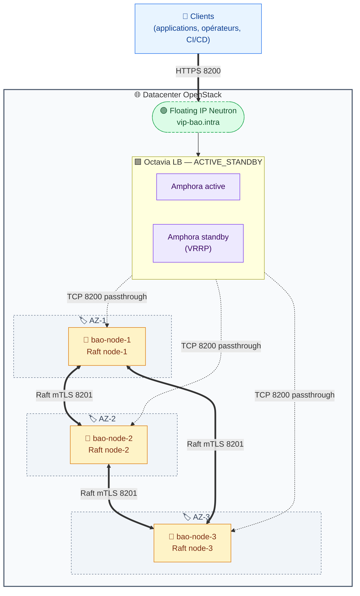

# Plan de migration HAProxy/Keepalived/FIP-script → Octavia (LBaaS OpenStack)

> Statut : **proposition, en attente de validation**. Aucune modification effectuée sur le code Ansible existant tant que ce plan n'est pas approuvé.

---

## 1. Décisions structurantes (validées)

| Décision | Choix retenu | Conséquence |
|---|---|---|
| Topologie LB Octavia | `ACTIVE_STANDBY` | Deux amphorae VRRP gérées par Octavia, bascule <5s, plus de paire ha-1/ha-2 à maintenir |
| Mode listener | `TCP` (passthrough) | OpenBao garde la terminaison TLS de bout en bout, iso à l'existant |
| Healthcheck | `HTTPS GET /v1/sys/health?standbyok=true&perfstandbyok=true` (codes 200, 429) | Iso à HAProxy actuel |
| Exposition | VIP Octavia sur subnet interne + Floating IP Neutron associée au port VIP | Le DNS `vip-bao.intra` continue de pointer sur la FIP, transparence côté clients |
| Algorithme | `ROUND_ROBIN` sans session persistence | Iso à l'existant, OpenBao redirige les writes vers le leader |
| Périmètre Terraform | LB Octavia uniquement (LB, listener, pool, members, monitor, FIP association) | Les VMs OpenBao restent gérées par Ansible / provisionnement existant |

---

## 2. Architecture cible

### 2.1 Ce qui disparaît

- **Rôle Ansible `haproxy`** — Octavia opère ses propres amphorae managées, il n'y a plus de HAProxy à installer/configurer sur des VMs dédiées.
- **Rôle Ansible `keepalived`** (déjà marqué deprecated) — la HA frontale est portée par Octavia (VRRP entre amphorae).
- **Rôle Ansible `openstack_fip`** (script Python + systemd timer + clouds.yaml + compte Keystone dédié au failover) — la FIP est statiquement associée au port VIP du LB, plus de bascule applicative.
- **Les 2 VMs ha-1 et ha-2** dans `inventories/production/hosts.yml` — on les retire de l'inventaire et on peut les détruire côté OpenStack.
- **Le compte Keystone restreint `policy.yaml`** pour `update_floatingip` — devient inutile (la FIP n'est plus déplacée).

### 2.2 Ce qui change

- **Inventaire** : le groupe `haproxy` disparaît, plus que le groupe `openbao` (3 nœuds).
- **Playbook `site.yml`** : on supprime les plays HAProxy + openstack_fip, il ne reste que le déploiement OpenBao.
- **nftables sur les nœuds OpenBao** : doit accepter le port 8200 depuis le **subnet du LB Octavia** (et plus depuis l'IP des HAProxy). On ajoute une variable `octavia_lb_subnet_cidr`.
- **README** : section architecture + diagramme Mermaid à reprendre, table de l'inventaire à mettre à jour, plan d'adressage simplifié.
- **RUNBOOK** : procédures de bascule HAProxy retirées, remplacées par procédures Octavia (lecture des stats `openstack loadbalancer status show`, recréation d'amphora, etc.).
- **docs/architecture.drawio** : nouveau schéma sans HA1/HA2, avec un seul bloc "Octavia LB (active-standby)".

### 2.3 Ce qui apparaît

- **Module Terraform** `terraform/octavia-lb/` qui crée :
  - 1 `openstack_lb_loadbalancer_v2` (topologie ACTIVE_STANDBY, sur le subnet interne)
  - 1 `openstack_lb_listener_v2` TCP:8200
  - 1 `openstack_lb_pool_v2` ROUND_ROBIN
  - 3 `openstack_lb_member_v2` (un par nœud OpenBao)
  - 1 `openstack_lb_monitor_v2` HTTPS sur /v1/sys/health (expected_codes "200,429")
  - 1 `openstack_networking_floatingip_associate_v2` pour rattacher la FIP existante au port VIP du LB
- **Variable Ansible `octavia_lb_subnet_cidr`** (CIDR du subnet où Octavia spawn ses amphorae) dans `group_vars/all/main.yml`, utilisée par le template `nftables.conf.j2` du rôle openbao.

### 2.4 Schéma logique cible (Mermaid)



---

## 3. Module Terraform — structure proposée

Arborescence dans `terraform/octavia-lb/` :

```
terraform/octavia-lb/
├── versions.tf              # required_providers (openstack ~> 3.0)
├── providers.tf             # provider openstack via clouds.yaml (cloud="openbao")
├── variables.tf             # toutes les inputs
├── main.tf                  # LB + listener + pool + monitor + FIP association
├── members.tf               # 3 ressources member (une par nœud OpenBao)
├── outputs.tf               # VIP IP, LB ID, FIP, etc.
├── terraform.tfvars.example # exemple à recopier
└── README.md                # comment l'utiliser
```

### 3.1 Ressources Terraform (résumé)

| Ressource | Rôle | Notes |
|---|---|---|
| `openstack_lb_loadbalancer_v2.openbao` | LB Octavia | `loadbalancer_provider = "amphora"`, `vip_subnet_id`, flavor optionnelle pour forcer ACTIVE_STANDBY si la flavor par défaut est SINGLE |
| `openstack_lb_listener_v2.openbao_8200` | Listener | `protocol = "TCP"`, `protocol_port = 8200` |
| `openstack_lb_pool_v2.openbao` | Pool backend | `protocol = "TCP"`, `lb_method = "ROUND_ROBIN"` |
| `openstack_lb_member_v2.bao_node[0..2]` | Membres | un par IP de nœud OpenBao, `protocol_port = 8200`, `subnet_id` du subnet OpenBao |
| `openstack_lb_monitor_v2.openbao_health` | Health monitor | `type = "HTTPS"`, `url_path = "/v1/sys/health?standbyok=true&perfstandbyok=true"`, `expected_codes = "200,429"`, `delay=5`, `timeout=3`, `max_retries=2`, `max_retries_down=3` |
| `openstack_networking_floatingip_associate_v2.openbao` | FIP → VIP du LB | utilise `data.openstack_networking_floatingip_v2` pour récupérer la FIP préallouée par UUID |

### 3.2 Variables d'entrée (extrait)

```hcl
variable "openstack_cloud"     { type = string  default = "openbao" }
variable "lb_name"             { type = string  default = "openbao-lb" }
variable "lb_flavor_id"        { type = string  default = null }   # optionnel
variable "vip_subnet_id"       { type = string }                   # subnet interne où le LB pose sa VIP
variable "members_subnet_id"   { type = string }                   # subnet où vivent les nœuds OpenBao
variable "openbao_nodes" {
  type = list(object({ name = string, address = string }))
  # ex. [{name="bao-node-1", address="10.10.0.10"}, ...]
}
variable "listener_port"       { type = number  default = 8200 }
variable "floating_ip_address" { type = string }                   # ex. "10.10.0.100" — la FIP préallouée
variable "health_check_path"   { type = string  default = "/v1/sys/health?standbyok=true&perfstandbyok=true" }
variable "expected_codes"      { type = string  default = "200,429" }
```

### 3.3 Outputs

- `lb_vip_address` — IP interne du LB (utile pour les nftables des nœuds)
- `lb_vip_port_id` — utile pour debug ou si on veut attacher d'autres choses
- `lb_id` — pour les commandes `openstack loadbalancer status show`
- `floating_ip_address` — la FIP rattachée (pour le DNS)

### 3.4 Points d'attention Terraform

1. **Flavor ACTIVE_STANDBY** : selon le tenant, la flavor par défaut Octavia peut être SINGLE. On expose `lb_flavor_id` en variable ; si non fournie, on documente comment lister les flavors (`openstack loadbalancer flavor list`) et choisir une `loadbalancer-topology = ACTIVE_STANDBY`.
2. **Idempotence FIP** : on utilise `floatingip_associate_v2` (et pas la création d'une nouvelle FIP) car la FIP doit rester celle déjà allouée et référencée dans le DNS — on la récupère via `data.openstack_networking_floatingip_v2` par son `address`.
3. **Ordre de création** : Terraform gère les dépendances implicites (member → pool → listener → LB), pas de `depends_on` explicite à priori.
4. **`provisioning_status`** : Octavia met le LB en `PENDING_CREATE` plusieurs minutes ; Terraform attend naturellement le passage à `ACTIVE`. Timeout par défaut OK (~10min).

---

## 4. Impacts sur le code Ansible existant

| Élément | Action |
|---|---|
| `roles/haproxy/` | **Supprimer** (ou archiver `roles/_deprecated/haproxy/` pour rollback) |
| `roles/keepalived/` | **Supprimer** (déjà marqué deprecated) |
| `roles/openstack_fip/` | **Supprimer** (ou archiver) |
| `playbooks/site.yml` | Retirer les 2 plays `haproxy` et `openstack_fip` |
| `playbooks/fip-failover-test.yml` | **Supprimer** |
| `inventories/production/hosts.yml` | Retirer le groupe `haproxy` (ha-1, ha-2) |
| `inventories/production/group_vars/haproxy.yml` | **Supprimer** |
| `inventories/production/group_vars/all/main.yml` | Retirer `haproxy_stats_allowed_sources` ; renommer `openbao_vip_fqdn` reste OK ; ajouter `octavia_lb_subnet_cidr` |
| `roles/openbao/templates/nftables.conf.j2` | Autoriser 8200 **uniquement depuis `octavia_lb_subnet_cidr`** (et plus depuis les IPs des HAProxy) |
| `monitoring/alerts.yml` | Retirer les alertes HAProxy/keepalived ; ajouter (optionnel) alertes Octavia via exporter Prometheus si disponible |
| `monitoring/prometheus-scrape.yml.j2` | Retirer la cible HAProxy stats |
| `docs/RUNBOOK.md` | Réécrire §HAProxy/§Keepalived/§FIP-failover → §Octavia (consultation status, recréation amphora, rotation cert amphora si pertinent) |
| `docs/architecture.drawio` | Nouveau schéma sans HA1/HA2 |
| `README.md` | Section 1/2/3/4/7/10 à reprendre |
| `molecule/cluster/` | Adapter ou supprimer les vérifs HAProxy |
| `.github/workflows/ci.yml` | Vérifier qu'aucune étape ne lint le rôle haproxy supprimé |

---

## 5. Procédure de bascule (production)

Migration sans coupure (les 3 nœuds OpenBao restent en place) :

1. **Pré-vérifs OpenStack** : confirmer que le service Octavia est exposé dans le catalogue Keystone (`openstack catalog list | grep load-balancer`), qu'il existe au moins une flavor amphora ACTIVE_STANDBY, et que le compte Terraform a les rôles `load-balancer_member` (au minimum).
2. **Terraform plan + apply** sur le module `terraform/octavia-lb/`. À l'issue : le LB est `ACTIVE` mais la FIP est encore sur ha-1.
3. **Pré-câblage nftables** : mettre à jour `octavia_lb_subnet_cidr` dans group_vars/all et **ajouter** (sans retirer l'ancien) l'autorisation 8200 depuis ce subnet sur les nœuds OpenBao via `ansible-playbook playbooks/site.yml --tags firewall`. À ce stade, les nœuds acceptent le trafic des deux sources.
4. **Test fonctionnel** depuis l'extérieur via l'IP **interne** du LB (`lb_vip_address` Terraform) :
   - `curl -k --resolve vip-bao.intra:8200:<lb_vip_address> https://vip-bao.intra:8200/v1/sys/health`
   - login bao + read d'un secret connu.
5. **Bascule FIP** : `terraform apply` avec la variable `floating_ip_address` renseignée → la FIP migre de ha-1 vers le port VIP du LB. Coupure observée : 1 à 5 secondes (le temps que Neutron mette à jour le port association).
6. **Validation** depuis l'extérieur via le DNS public : `curl https://vip-bao.intra:8200/v1/sys/health`.
7. **Arrêt propre des HAProxy** : `ansible -i inventories/production haproxy -m systemd -a "name=haproxy state=stopped enabled=no"`. On laisse les VMs ha-1/ha-2 allumées 24-48h en sécurité, puis on les détruit.
8. **Nettoyage** : supprimer les rôles, le groupe d'inventaire, mettre à jour la doc, retirer du nftables OpenBao l'ancienne autorisation depuis ha-1/ha-2, commit Git.

### Procédure de rollback

Si problème durant le créneau de migration : `terraform apply` avec la FIP réassociée manuellement au port de ha-1 via `openstack floating ip set --port <port_ha1_id> <fip_id>`. Les HAProxy étant restés actifs jusqu'à l'étape 7, le service revient en quelques secondes.

---

## 6. Compromis et limitations Octavia (à acter)

| Sujet | HAProxy actuel | Octavia | Verdict |
|---|---|---|---|
| Dépendance plateforme | Aucune (HAProxy = paquet Debian) | Forte (Octavia doit être déployé, supporté et patché par l'équipe OpenStack) | Acceptable ici puisque "on active Octavia" |
| Visibilité config LB | `/etc/haproxy/haproxy.cfg` versionné, lisible | API Octavia, abstrait — debug via `openstack loadbalancer status show` | OK |
| Latence ajoutée | ~0.2 ms (process local) | ~0.5-1 ms (amphora = VM dédiée) | Négligeable |
| Coût ressources | 2 petites VMs HAProxy | 2 amphorae Octavia (VMs gérées) | Équivalent |
| Granularité bascule | 30-45 s (timer FIP) | <5 s (VRRP entre amphorae) | **Octavia gagne** |
| Personnalisation fine HAProxy | Totale (tous les params HAProxy) | Limitée à ce qu'expose l'API Octavia | OK pour le besoin (TCP+healthcheck) |
| Audit/traçabilité | Logs `/var/log/haproxy` sur VMs nous | Logs sur amphorae managées, accès via Octavia API ou stockage tenant | À vérifier avec l'équipe Octavia |
| Compteurs / stats | Page stats HAProxy `:8404` | Statistiques via `openstack loadbalancer stats show` ou exporter Prometheus Octavia | OK |

**Risque résiduel** : si le control plane Octavia (octavia-api, octavia-worker) tombe, on ne peut plus *modifier* le LB, mais le dataplane (les amphorae) continue de servir le trafic. C'est documenté côté OpenStack et équivalent à n'importe quel service managé.

---

## 7. Livrables prévus une fois ce plan validé

1. `terraform/octavia-lb/` complet (8 fichiers listés en §3).
2. `inventories/production/hosts.yml` épuré (groupe haproxy retiré).
3. `inventories/production/group_vars/all/main.yml` mis à jour (ajout `octavia_lb_subnet_cidr`).
4. `roles/openbao/templates/nftables.conf.j2` mis à jour (autorisation 8200 sourcée sur subnet LB).
5. `playbooks/site.yml` épuré (plays haproxy + openstack_fip retirés).
6. Rôles `haproxy/`, `keepalived/`, `openstack_fip/` déplacés vers `roles/_deprecated/` (pour rollback rapide) puis supprimés en commit séparé.
7. `README.md` réécrit (sections 1/2/3/4/7/10).
8. `docs/RUNBOOK.md` réécrit pour la partie frontale.
9. `docs/architecture.drawio` + export PNG mis à jour.
10. Optionnel : workflow CI mis à jour, alertes Prometheus retirées/adaptées.

---

## 8. Points encore ouverts (à confirmer une fois en exécution)

- **Flavor Octavia ACTIVE_STANDBY** disponible sur le tenant ? (à valider via `openstack loadbalancer flavor list` — on rendra `lb_flavor_id` optionnel mais on documentera la marche à suivre si besoin de la créer).
- **CIDR du subnet d'amphorae** Octavia — pour le filtrage nftables des nœuds OpenBao.
- **UUID/adresse de la Floating IP préallouée** — déjà connu (`openstack_floating_ip_id` dans le vault actuel), on le réutilise tel quel.
- **Provider OpenStack Terraform** : on partira sur `terraform-provider-openstack/openstack ~> 3.0` (la dernière major stable au moment de la rédaction). À confirmer si le tenant impose une autre version.
